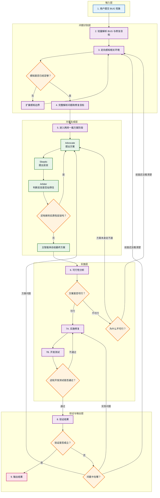

# yeizi-command-bug-workflow 重构最终参考文

## 文档定位

这份文档不是最终对外 README，也不是最终写回 skill 的正文。

它是本次优化 `yeizi-command-bug-workflow` 时的：

- 最终参考文
- 重构依据文
- 步骤拆分说明文
- 流程边界说明文

这份文档的目标只有一个：

- 给后续重构 `yeizi-command-bug-workflow` 提供稳定依据，说明为什么这样拆步骤、每一步边界在哪里、前后逻辑为什么这样衔接。

当前约定：

- 如果流程图和正文有出入，**先以正文写的规则为准**
- 流程图只用来帮助理解，不拿来决定到底该回哪一步、每一步到底负责什么、具体该怎么执行

---

## 这个 skill 的核心定位

`yeizi-command-bug-workflow` 不是给需求讨论、方案发散、模糊排查兜底用的方向。

它的定位是：

- 一个用于“故障现象已经出现，但根因还没定位清楚，不能直接开改”的修复流程

它最适合处理的是这类问题：

- 某个功能以前是正常的，现在坏了
- 某条行为明确不符合预期，但原因还不清楚
- 某个报错、失败路径、错误结果已经出现，但断点还没定位出来
- 涉及多个模块、调用链或状态流，直接动手改风险很高

它不适合处理的是这类事情：

- 还在讨论“要做什么功能”
- 还在发散“有哪些方案可以选”
- 还没有明确异常现象，只是模糊觉得“系统可能哪里不太对”
- 本质上是产品决策、需求澄清、方案设计，而不是故障修复

它的核心原则是：

- 宁愿多花时间和 token，也要换取更高的正确率
- 不靠第一感觉直接修
- 不把猜测当事实
- 不把未验证当已验证
- 不为了流程完整而跳过诊断

---

## 完整流程图

**下面这张 Mermaid 图只用来帮助理解流程，不作为重构时的最终判断依据。**

**图例：**
- 实线箭头：流程执行顺序
- 节点颜色：蓝=输入，紫=处理，绿=智能体，橙=判断，粉=输出

补充说明：

- 上图只是流程可视化
- 真正用于重构时，还是以后文正文写的规则为准

下面按固定结构展开每一步：

- 这一步做什么
- 这一步收获什么
- 为什么这么做
- 这一步的限制

---

## 第 1 步：接受用户输入的 BUG

### 本步内容

- 接收用户报上来的故障现象
- 记录用户此刻明确说出来的问题描述

### 本步产出

- 一个原始 bug 报告
- 未经验证的用户视角描述

### 设立原因

因为整个流程必须从用户报告的现象开始，而不是从模型自己的猜测开始。

如果连用户到底报了什么都没接准，后面的搜索、判断、修复都会跑偏。

### 边界限制

- 这里只接收输入，不判断根因，不进入修复

---

## 第 2 步：轻量解析 BUG 与修复目标

### 本步内容

只基于用户当前这次描述，生成下一步感知环境的起点。

本步产出

- 初始感知方向：优先从哪个模块、哪类文件开始查
- 初始感知范围起点：感知到哪里为止

### 设立原因

因为不能一上来就无边界地扫描整个项目。

如果没有轻量解析，下一步“环境感知”会变成：

- 什么都看
- 哪里都像相关
- token 消耗很大
- 但判断质量不一定更高

所以这一步只负责给环境感知划一个起始边界。

### 边界限制

- 这里只负责划初始感知边界，不判断实际影响范围，不输出完整问题定义

### 命名原因

因为它不是完整解析。

它只是：

- 先听懂用户在说什么
- 先决定应该从哪里开始看

而不是：

- 现在就把问题彻底看透

---

## 第 3 步：定向感知相关环境

### 本步内容

沿着上一步得到的初始感知方向，去做有目标的定向感知。

感知对象包括但不限于：

- 相关模块
- 相关文件
- 相关配置
- 相关状态流
- 相关日志
- 相关测试
- 最近改动
- 相关调用链

### 本步产出

- 感知到的代码和环境信号
- 感知到的异常点
- 感知到的相关区域
- 本次感知的范围边界：感知到了什么程度

### 设立原因

因为仅靠用户报告，只知道现象，还不知道代码和环境里到底出了什么问题。

### 边界限制

- 感知必须定向展开，不能无边界扫描，也不能在证据不足时直接定根因或进入修复
- 如果当前边界不够，就扩大，但必须基于疑似相关性，不能全面扫图

### 什么时候算“感知已足够”

进入第 4 步之前，下面这几件事里，前 3 件必须先说清，第 4 件最好也能说清：

- 能指出一个或数个高相关的疑似失败区域，而不是只有宽泛模块名
- 能说清当前看到的是哪些事实、哪些只是推测
- 能描述“应恢复的行为”大致落在哪条路径上
- 能说明如果继续往下看，最值得补看的方向是什么

如果前 3 件里有任何一件还说不清，就不要进第 4 步，继续补感知。

---

## 第 4 步：完整解析问题和修复目标

### 本步内容

在看过环境之后，重新定义问题。

这一步会把前面拿到的现象、代码信号、限制条件整理成一版更完整的问题定义，内容包括：

- 实际失败点
- 应恢复的正常行为
- 已确认的事实
- 仍然未知的部分
- 当前证据支持的受影响范围
- 修复目标应落到的范围

### 本步产出

- 基于证据的问题定义
- 基于证据的修复目标
- 事实列表、未知项列表、边界信息

### 设立原因

因为前面的"轻量解析"只是为了启动调查。

完整解析只能在看过相关环境之后发生。

否则所谓"完整解析"只是用猜测假装完整。

### 边界限制

- 这里只定义问题和修复目标，不直接决定修复路径，也不把可能原因写成已确认根因

### 与轻量解析的区别

轻量解析：

- 基于用户报告
- 产出初始感知范围起点

完整解析：

- 基于环境证据
- 产出基于证据的问题定义

---

## 第 5 步：生成问题解决方案

### 本步内容

在完整问题定义的基础上，生成多个候选解决方案。

执行方式采用两辩一裁模式（Advocate-Skeptic-Arbiter Triple Agent Pattern）。

#### 第一阶段：主智能体准备上下文并创建子智能体群体

主智能体准备好子智能体所需的上下文：
- 完整诊断上下文（Steps 1-4 的全部产出）
- 问题定义
- 已确认的事实
- 仍存在的未知部分
- 当前证据支持的受影响范围

主智能体创建三个子智能体，组成子智能体群体，共同进入循环执行。

#### 第二阶段：子智能体群体循环执行

群体内部循环执行 Advocate-Skeptic-Arbiter 三角色交互，直到退出条件满足：

Advocate（提案拥护者）：
- 基于上下文提出候选解决方案
- 说明这个方案解决了问题的哪个环节
- 列出支持这个方案可行的证据

Skeptic（质疑辩驳者）：
- 针对 Advocate 当前方案进行反驳
- 找出方案的漏洞和反例
- 找出方案未覆盖的场景
- 找出方案依赖但可能不成立的前提
- 列出能推翻 Advocate 方案的核心证据

Arbiter（中立仲裁者）：
- 判断 Skeptic 当前提出的反驳是否已经被 Advocate 有效回应
- 判断 Skeptic 是否仍有新的实质性反驳意见
- 如果仍有新反驳 → 通知 Advocate 进入下一轮，Advocate 回应后再由 Skeptic 继续反驳
- 如果没有新反驳 → 宣布本轮结束，输出最终裁决

这里有几个执行规则：

- 只要 Skeptic 仍能提出新的实质性反驳，就应继续循环；不要因为节省 token、追求更快结束或流程看起来已经够完整，就提前停止
- 如果连续两轮都没有出现会影响下一步判断的新东西，就可以收住，不要开始机械重复

“新的实质性反驳”至少应满足以下之一：

- 指出当前方案无法达成第 4 步定义的修复目标
- 指出当前方案依赖了其实还没站稳的前提
- 指出当前方案遗漏了高风险路径、关键异常分支，或者容易被带坏的地方
- 提出一个风险更低、更简单、或者更容易验证的替代方向

这个循环什么时候可以停：

- Skeptic 没有新的实质性反驳意见，或
- Arbiter 判定现有反驳已被充分回应，或
- 继续循环只会重复前面已经说过的话，不会再带来新的判断依据

群体循环执行期间，主智能体不干预，等待结果回传。

#### 第三阶段：结果回传主智能体

子智能体群体执行完毕后，把整理过的讨论结论回传给主智能体，不要机械地把每一轮原文整段倒回来。

整理后的结果至少包括：

- 当前保留下来的主方案
- 关键反驳点及其回应情况
- 仍未完全消除的风险或不确定性
- 为什么主智能体应采纳当前方案而不是其他候选路径

主智能体读取回传的讨论结论，总结并给出本步的最终解决方案。

### 本步产出

- 最终解决方案

### 设立原因

因为完整问题定义不等于已经知道怎么修。

单个智能体容易出现锚定效应：第一个看起来合理的方案就一路冲下去，只找支持自己的证据。

两辩一裁的循环结构让方案必须经历持续挑战：Advocate 提出方案，Skeptic 反驳，Arbiter 判断是否还有新反驳，Advocate 回应后再挑战，直到 Skeptic 没有新的实质性反驳为止。主智能体在此基础上总结出最终方案。

### 边界限制

- Skeptic 每轮必须提出新的实质性反驳，不能重复已回应过的内容
- Arbiter 必须独立判断，不提前偏向任何一方
- 主智能体在循环期间不干预，等待群体结果回传后再总结

### 单独拆出的原因

因为到这一步，工作重点已经从“继续定义问题”变成了“为修复判断准备解释”。

---

## 第 6 步：可行性分析

### 本步内容

判断第 5 步生成的最终解决方案是否可以在当前项目中实施。

本步主要分析这些内容：

- 当前项目环境是否支持这个方案实施
- 方案所需的依赖和前提条件是否满足
- 方案实施是否影响其他模块或功能
- Skeptic 提出的未解决反驳是否构成实施障碍

如果可行性分析不通过，不是一律回到同一个步骤，而是按原因回流：

- **方案本身走不通**：方案和项目约束冲突、代价明显过大，或者放到当前系统里根本落不了地 → 返回第 5 步重新生成方案
- **前面还没看清楚**：当前还判断不了某些前提到底成不成立，或者环境边界还没看明白 → 返回第 3 步补充感知，并重新经过第 4 步

### 本步产出

- 可行性分析结果
- 如有不可行因素，明确列出

### 设立原因

因为第 5 步的方案经过了完整的循环验证，但有方案不等于可以直接动手。

还需要判断这个方案在当前项目中是否真的可以实施。

### 边界限制

- 这里只判断方案是否可行，不重新讨论方案本身
- 如果不可行，必须明确是“方案本身走不通”还是“前面还没看清楚”，不能笼统写成“先回去再看看”

---

## 第 7 步：实施修复

### 本步内容

对第 6 步可行性分析通过的方案进行实际修改，并做即时小规模测试。

执行方式分两个子步，循环执行直到通过：

#### 子步 A：执行修复

按照通过的方案执行代码修改，遵循以下原则：

- 用最少的代码解决问题
- 不要添加方案外的功能
- 不要为一次性代码创建抽象
- 不要添加未要求的"灵活性"或"可配置性"
- 只碰必须碰的
- 不"改进"相邻的代码、注释或格式
- 不重构没坏的东西
- 匹配现有代码风格
- 如果改动产生孤儿代码，删除因改动而变得无用的导入、变量或函数

#### 子步 B：开发测试

代码审计和白盒测试，检查本次修复是否完整。

这里不要求所有项目都用同一套固定检查项，而是要根据当前项目实际情况，优先做**最直接、最贴近这次修改**的小范围检查。

常见检查包括但不限于：

- 检查修改的文件是否已经全部修复，是否还有残留
- 当前实现是否已经覆盖第 6 步方案要求的关键修改点
- 与本次修改直接相关的局部路径是否存在明显中断
- 如果项目有编译步骤，就看编译是否报错
- 如果项目有单元测试或局部测试，就跑最相关的那部分

核心不是把固定清单机械跑一遍，而是用最合适的局部检查，尽快发现这轮修复有没有明显问题。

子步 B 循环判断：如果发现问题，回到子步 A 继续修复，直到子步 B 通过，然后进入第 8 步。

### 本步产出

- 完整代码修改内容
- 足够支撑下一步判断的开发测试结果

### 设立原因

把开发和测试分开，可以让每次修复后都有即时反馈，避免一次性改完再测发现一堆问题再回头改。

开发测试只做小规模测试（代码审计、白盒测试、局部路径检查等），不做大规模集成测试，也不在这一步正式宣布“bug 已修复”；“是否真的修好”统一放到第 8 步判定。

### 边界限制

- 只执行第 6 步通过的方案，不做方案外的改动
- 开发测试只做小规模测试，不做大规模集成测试
- 不要求把项目里所有能跑的检查都跑一遍，只要求优先跑和这次修改最相关、最能尽快发现问题的局部检查
- 如果测试不通过，必须回到子步 A 继续修复，不能跳过

---

## 第 8 步：验证结果

### 本步内容

验证修复是否达成第 4 步定义的修复目标，并进行相关内容的回归测试。

**验证范围至少包括：**

- 原始失败路径是否恢复
- 修复后的成功路径是否正常
- 邻近区域的明显回归
- 与修复目标相关的其他功能是否受影响

同时要区分清楚：

- 哪些是静态检查确认的
- 哪些是运行或测试确认的
- 哪些还没验证

**失败判断与反馈路径**

如果测试不通过，判断失败原因并反馈到对应的步骤：

- 如果是方案层面的问题（例如修复方向错误、方案无法达成修复目标）→ 反馈给第 5 步重新生成方案
- 如果是代码实现层面的问题（例如修复执行不完整、遗漏了部分修改）→ 反馈给第 7 步重新执行修复
- 如果是前面还没看清楚的问题（例如一开始界定的受影响范围不对、关键环境事实没看到）→ 反馈给第 3 步补充感知，并重新经过第 4 步

### 本步产出

- 对修复结果的判断
- 验证证据
- 未完全确认项列表

### 设立原因

因为"代码改了"不等于"问题解决了"，第 7 步的开发测试只是小规模测试，这里需要更大范围的验证和回归测试。

这一步是把"我觉得修好了"变成"我有验证结果说明它修好了"。

### 边界限制

- 只能报告已经验证过的结果，不能把未运行、未测试、未覆盖的范围写成已确认
- 失败时必须明确区分是方案问题、代码问题，还是前面还没看清楚的问题，对应反馈到正确的步骤
- 只有第 8 步有资格正式判断“原始 bug 是否被修复成立”，第 7 步没有这个裁定权

---

## 第 9 步：输出结果

### 本步内容

向用户输出最终结果。

输出内容包括：

- bug 现在到底解决了没有
- 问题是什么
- 怎么解决的
- 改了什么
- 影响哪些内容
- 为什么现在能确认已经修好，或者为什么现在还不能这么确认

### 本步产出

- 最终结果说明

### 设立原因

因为最后交付给用户的应该是问题的最终解决方案，不是一长串中间搜索过程。

### 边界限制

- 只能把已经确认的结果说成“已经解决”；如果还没法确认，就直接说现在还不能确认已经修好
- 不堆内部搜索过程
- 不展开测试过程本身，但必须把“为什么现在能确认修好”或者“为什么现在还不能确认修好”讲清楚

---

## 每一步的边界总结

为了让流程低耦合，这里把每一步最核心的职责边界再压缩总结一次。

| 步骤 | 主要职责 | 限制 |
| --- | --- | --- |
| 接受用户输入的 BUG | 接收原始问题输入 | 直接认定根因 |
| 轻量解析 BUG 与修复目标 | 给感知环境划初始感知边界 | 判断实际影响范围、实际约束 |
| 定向感知相关环境 | 找环境证据和异常信号 | 无边界扫描全项目、提前定根因 |
| 完整解析问题和修复目标 | 定义基于证据的问题和修复目标 | 直接决定修复方案 |
| 生成问题解决方案 | Advocate 提方案，Skeptic 反驳，Arbiter 裁决并把方案收住 | 在仍有实质性反驳时因为想省 token 而提前停止，或输出原始逐轮全文 |
| 可行性分析 | 结合第 4 步问题定义和第 5 步方案，分析实施可行性 | 跳过可行性分析直接进入实施，或不区分方案走不通和前面还没看清楚 |
| 实施修复 | 执行最小完整修复 | 混入无关改动 |
| 验证结果 | 用证据确认修复是否成立，并分清失败卡在哪一层 | 未验证就宣布成功，或把方案问题和实现问题混为一谈 |
| 输出结果 | 向用户交付 bug 是否解决、怎么解决、影响哪些内容，以及为什么现在能这么判断 | 没确认就说已经修好，或把内部验证过程整段倒给用户 |

---

## 一句话总结

`yeizi-command-bug-workflow` 不应该是“看见 bug 就开始修”，而应该是：

- 先轻量理解用户报告
- 再定向感知相关环境
- 再完整定义问题
- 再把方案辩清楚、收住
- 再判断方案是否可实施
- 再执行修复
- 再验证结果
- 最后把结果和为什么能这么判断讲清楚

这才符合“宁愿多花时间和 token，也要提高准确性”的故障修复流程。
