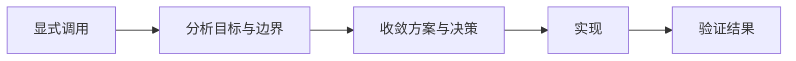
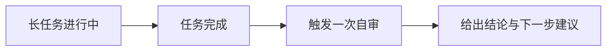
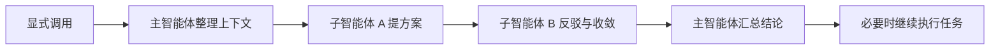

# yeizi-skills

面向软件开发协作的 skills 集合。

## 什么时候用哪个 skill

### `complex-task-workflow`

适合这些场景：

- 需要显式调用，适合复杂 BUG、复杂技术问题、需求分析
- 涉及多模块、架构变更、技术不确定性，不能直接只改一个点
- 需要先收敛目标、边界和方案，再正式动手实现

基本流程：

1. 明确目标、边界、风险和验证标准
2. 比较方案，收敛关键决策
3. 实现结果并验证，必要时回滚或修正

### `dev-refine-and-self-review`

适合这些场景：

- 适合长任务收尾，比如修 BUG、补功能、重构、联调、提测前检查
- 不是先讨论方案，而是先把任务做完，再看还有没有遗漏和风险
- 这是关键词自动触发的 skill，自审结果默认会直接给用户看

基本流程：

1. 先完成当前长任务
2. 基于最新结果做一次自审
3. 告诉用户是继续优化、可以推进，还是还需要补验证

### `pair-program`

适合这些场景：

- 需要显式调用，适合中小问题的方案讨论、接口设计、重构取舍、测试策略
- 不想让单个智能体直接回答，而是希望先内部讨论再给结论
- 如果请求里还包含实现、验证或修改，也会在讨论后继续把任务做完

基本流程：

1. 主智能体整理上下文和问题
2. 两个子智能体一提方案、一做反驳，内部讨论 `3~10` 轮
3. 主智能体汇总结论，必要时继续执行真实任务

