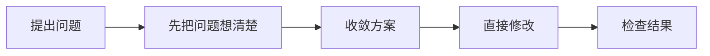
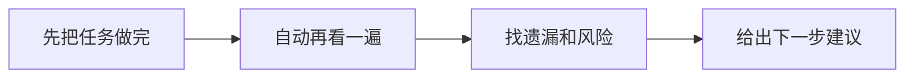
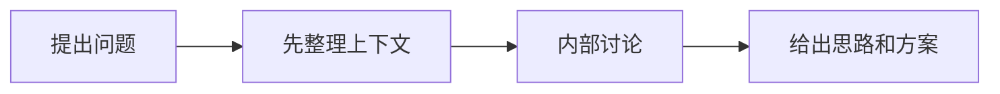

# yeizi-skills

这是一个给软件开发配套用的 yeizi skills 集合。

命名规则：

- `yeizi-command-*`：用户显式输入命令后触发
- `yeizi-auto-*`：根据关键词和上下文条件自动触发

## `yeizi-command-bug-workflow`

> 复杂 bug、技术问题、回归问题不好直接修时，用它让 AI 从诊断一路做到修复和验证。

**怎么用**

`/yeizi-command-bug-workflow <你需要解决的问题>`

**什么时候用**

- 这个 bug 比较复杂，不是改一两个地方就能完事
- 这个问题的根因不清楚，需要先定位再修
- 你需要的不是一个猜测，而是一整套从诊断到验证的处理过程

**流程图**

## `yeizi-auto-self-review`

> 事情做完了，但你还想让 AI 自动再检查一遍有没有遗漏、风险或下一步建议时，就用这个。

**怎么用**

自动触发，无需手动命令。\
当长任务请求里带有复查、自审、校验这类关键词时触发。

**什么时候用**

- 一个大任务刚做完，想知道还有没有坑
- bug 修完了、功能补完了、重构做完了，想再查一遍
- 你想拿到下一步该继续补什么的建议

**流程图**

## `yeizi-command-pair-program`

> 还没想清楚怎么做时，用它先让 AI 帮你整理上下文、讨论方案，再给出更稳的结论。

**怎么用**

`/yeizi-command-pair-program <你需要解决的问题>`

**什么时候用**

- 这个 bug 不知道该怎么改
- 这个需求不知道该怎么实现
- 你想先拿思路和方案，不想让 AI 直接改代码

**流程图**

