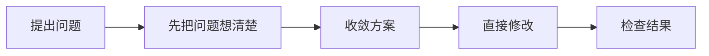
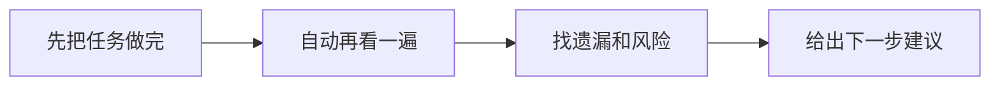
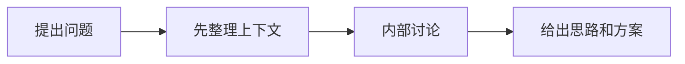

# yeizi-skills

这是一个给软件开发配套用的 skills 集合。

## `complex-task-workflow`

> 问题比较复杂，想让 AI 直接从分析一路做到修改和验证，就用这个。

**怎么用**

`/complex-task-workflow <你需要解决的问题>`

**什么时候用**

- 这个 bug 比较复杂，不是改一两个地方就能完事
- 这个需求要改很多地方，想让 AI 直接往下做
- 你需要的不是一个想法，而是一整套从分析到落地的处理过程

**流程图**

## `dev-refine-and-self-review`

> 事情做完了，但你还想再让 AI 帮你看一眼有没有遗漏，就用这个。

**怎么用**

自动触发，无需手动命令。\
当长任务请求里带有自审关键词时触发。

**什么时候用**

- 一个大任务刚做完，想知道还有没有坑
- bug 修完了、功能补完了、重构做完了，想再查一遍
- 你想拿到下一步该继续补什么的建议

**流程图**

## `pair-program`

> 还没想清楚怎么做，先让 AI 帮你想办法，就用这个。

**怎么用**

`/pair-program <你需要解决的问题>`

**什么时候用**

- 这个 bug 不知道该怎么改
- 这个需求不知道该怎么实现
- 你想先拿思路和方案，不想让 AI 直接改代码

**流程图**

